# Détection, classification et maturité des réticulocytes en microscopie numérique

*Chaîne d'inférence de bout en bout : détection d'objets (EfficientDet-D4),
segmentation du réticulum (U-Net) et calibration de la fraction de réticulocytes
immatures à partir de proportions agrégées.*

## Résumé

Le comptage des réticulocytes et la mesure de leur maturité sont deux examens
courants d'hématologie. Ils sont habituellement réalisés par cytométrie en flux,
par fluorescence. Ce travail étudie leur estimation à partir d'images de
microscopie optique d'échantillons colorés au nouveau bleu de méthylène.

Nous montrons d'abord que les erreurs d'un détecteur EfficientDet-D4 de référence
sont des erreurs de classification et non de détection. Un réentraînement
contrôlé, sans changement d'architecture, porte le rappel des réticulocytes de
75,74 % à 79,49 % et le F1 macro de 82,93 à 90,33. Le pourcentage de
réticulocytes (%RET) qui en résulte reproduit celui d'un analyseur de référence
(Sysmex XN) à 0,78 point près sur 53 tests, sans biais significatif.

En l'absence de vérité terrain de maturité à l'échelle de la cellule, nous
formulons la maturité comme une *mesure* plutôt que comme une *classe*. Un U-Net
de 119 313 paramètres segmente le réticulum pixel par pixel ; ses masques ne se
distinguent pas d'une seconde lecture du même annotateur. Un seuil unique, ajusté
sur des proportions par échantillon, en déduit la fraction de réticulocytes
immatures (IRF). Celle-ci est reproduite à 2,39 points près sur 11 échantillons
réservés et à 2,72 points près sur 40 nouveaux échantillons. La chaîne complète
traite un test de 60 images (≈ 24 000 cellules) en 35 s sur un GPU grand public.

**Mots-clés** : détection d'objets, segmentation, réticulocytes, apprentissage à
partir de proportions, comparaison de méthodes, imagerie médicale.

## Contributions

1. **Diagnostic du détecteur de référence** sur un jeu de test séparé au niveau
   de l'échantillon. Sur les 239 réticulocytes manqués, 232 sont détectés mais mal
   classés : le verrou est la frontière hématie / réticulocyte, non la localisation.
2. **Une campagne de réentraînement contrôlée** : 40 entraînements, un seul
   facteur modifié à la fois, variance inter-graines mesurée au préalable. Elle
   donne +3,75 points de rappel et +2,79 points de F1 sur les réticulocytes.
3. **La mesure de l'accord inter-lecteurs**, qui établit un plafond de
   performance : un second lecteur humain n'atteint pas 95 % de précision sur
   cette tâche.
4. **Une formulation de la maturité comme mesure continue** : un U-Net dont les
   entrées sont construites à partir de la loi de Beer-Lambert et d'une
   déconvolution à deux colorants, entraîné sur un corpus de 200 imagettes
   annotées au pixel constitué pour ce travail.
5. **Une calibration à paramètre unique de l'IRF** sur proportions agrégées,
   évaluée sur une cohorte réservée puis sur une cohorte élargie, selon les
   méthodes de comparaison du guide CLSI EP09c.
6. **Une chaîne d'inférence GPU complète** (ce dépôt), dont les sorties ont été
   vérifiées identiques au bit près à celles de la chaîne d'étude.

---

## Sommaire

1. [Problématique](#1-problématique)
2. [Méthodes](#2-méthodes)
3. [Résultats](#3-résultats)
4. [Discussion et limites](#4-discussion-et-limites)
5. [Reproduction](#5-reproduction)
6. [Organisation du dépôt](#6-organisation-du-dépôt)
7. [Références](#références)

---

## 1. Problématique

### 1.1 Contexte biologique

Le réticulocyte est un globule rouge immature, fraîchement libéré par la moelle
osseuse, qui contient encore de l'ARN ribosomal résiduel. Chez l'adulte sain, sa
proportion est de 0,5 à 2,5 % des hématies ; elle reflète l'activité de
production de la moelle. Le contenu en ARN décroît continûment pendant la
maturation, en 24 à 48 heures. Les analyseurs à fluorescence répartissent la
population en trois fractions, LFR, MFR et HFR (fluorescence faible, moyenne,
forte). La fraction de réticulocytes immatures, IRF = (MFR + HFR) / RET, précède
de plusieurs jours la variation du comptage total lors d'une reprise médullaire
(CLSI, 2004).

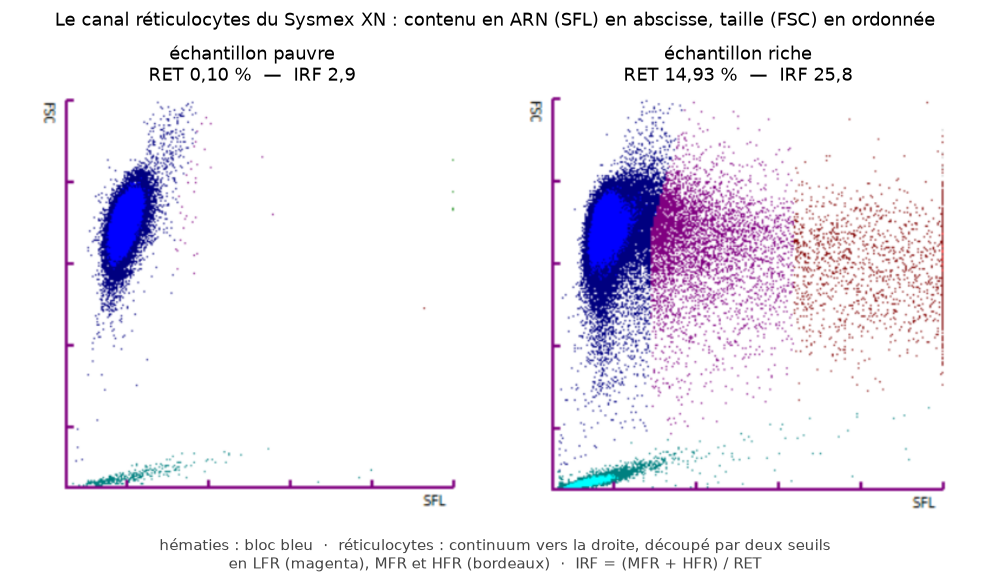

Ces trois fractions ne correspondent à aucune frontière biologique : elles
résultent de deux seuils conventionnels posés sur une distribution continue.
Cette observation guide la conception du modèle de maturité (§ 2.3).

### 1.2 Données d'imagerie

Les images proviennent d'un analyseur d'hématologie par microscopie numérique.
Chaque échantillon est coloré par un colorant vital, le nouveau bleu de méthylène
(NMB), qui fait précipiter l'ARN des réticulocytes en un réseau granulaire. Un
test comprend 60 acquisitions de 4096 × 2160 pixels, soit environ 570 objets par
image, dont 3 à 5 % de réticulocytes.

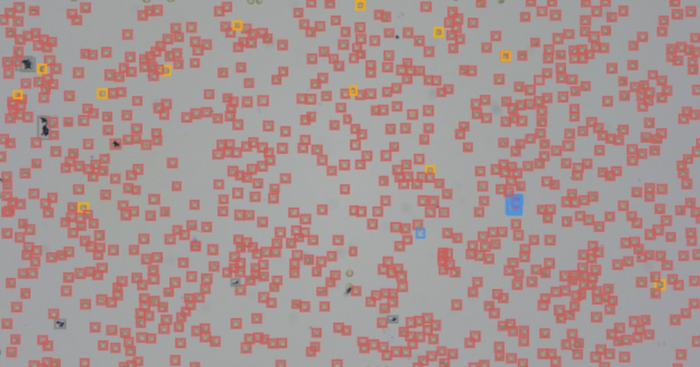
*Une acquisition après détection : hématies en rouge, débris en jaune,
réticulocyte en bleu.*

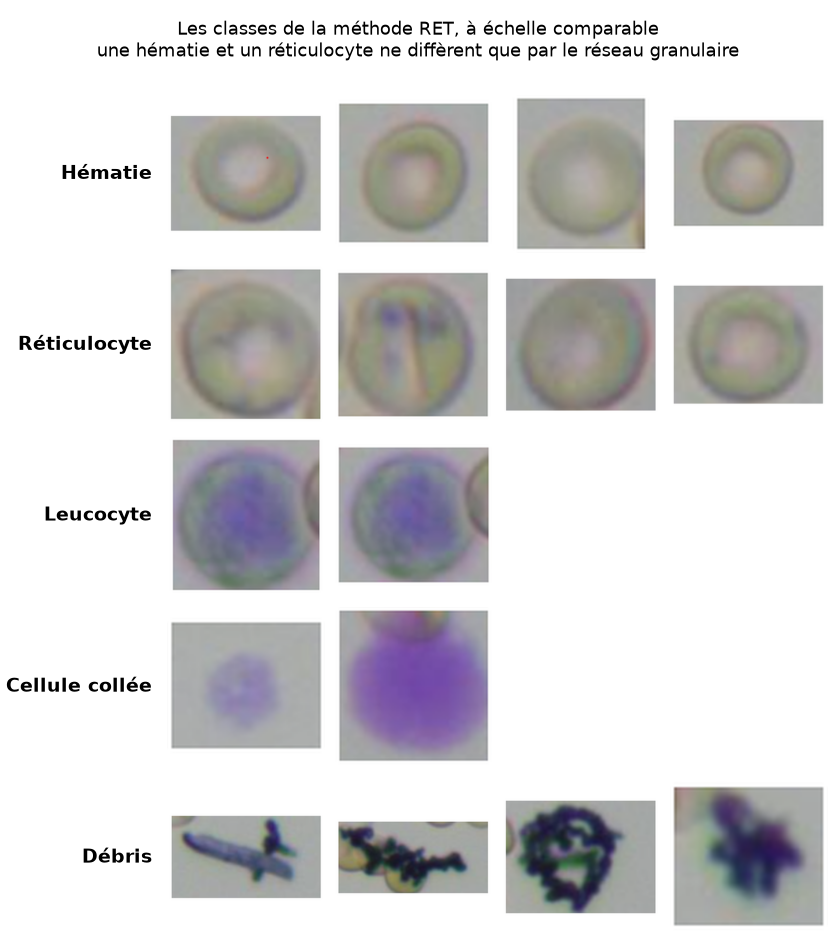

### 1.3 Difficultés

Une hématie et un réticulocyte ne diffèrent que par ce réseau intracellulaire,
dont le contraste dépend du lot de colorant, de l'éclairage et de la mise au
point. Plusieurs artefacts imitent en outre une granulation : ombres portées,
débris superposés, inclusions érythrocytaires (corps de Heinz, de Howell-Jolly)
et précipités de colorant.

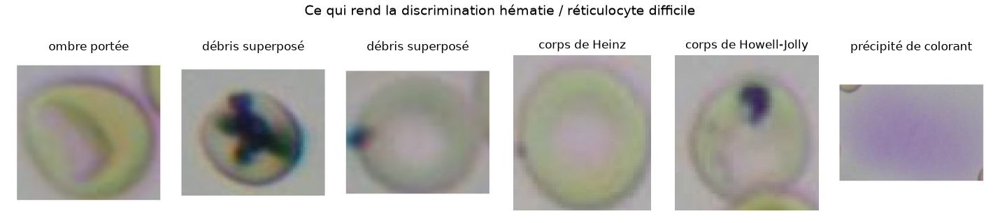

Le volet maturité pose une difficulté d'une autre nature : **il n'existe aucune
vérité terrain de maturité à l'échelle de la cellule**. L'analyseur de référence
ne fournit que des proportions par échantillon.

---

## 2. Méthodes

### 2.1 Vue d'ensemble

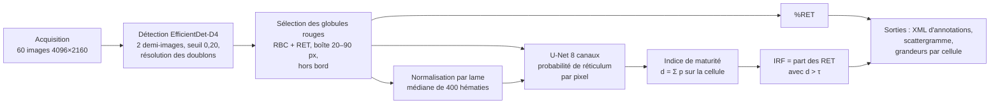

La chaîne produit deux grandeurs de nature différente. Le pourcentage de
réticulocytes est un rapport de comptes du détecteur ; il ne comporte **aucun
paramètre ajusté** :

```math
\mathrm{\%RET} = 100 \times \frac{N_{\mathrm{RET}}}{N_{\mathrm{RBC}} + N_{\mathrm{RET}}}
```

La fraction de réticulocytes immatures repose sur un indice continu $d_i$ calculé
pour chaque réticulocyte $i$ (§ 2.3), et sur **un seul paramètre ajusté**, la
porte $\tau$ (§ 2.4). En notant $\Omega_i$ les pixels de la cellule et
$\mathcal{R}$ l'ensemble des réticulocytes :

```math
d_i = \sum_{p \in \Omega_i} \hat{P}(\text{réticulum} \mid p),
\qquad
\mathrm{IRF} = 100 \times \frac{\left|\{\, i \in \mathcal{R} : d_i > \tau \,\}\right|}{|\mathcal{R}|}
```

### 2.2 Détection et classification

**Modèle.** EfficientDet-D4 (Tan et al., 2020), à quatre classes : hématie,
réticulocyte, leucocyte, débris. L'acquisition est découpée en deux demi-images
de 2048 × 2160 pixels, redimensionnées en 1024 × 1024 dans le graphe. Les
détections sont décodées dans le repère de l'image entière, puis les doublons
inter-classes (un NMS par classe) sont résolus globalement, par score
décroissant. Ce post-traitement a été vérifié cellule par cellule contre les
sorties de l'instrument (422/422 et 412/412 cellules sur deux acquisitions).

**Données.** Le jeu initial (290 images) a été entièrement réannoté, puis
reconstitué sous le nom **RET v4**, séparé au niveau de l'échantillon pour le jeu
de test. Une seconde passe assistée a concentré la relecture sur les cellules où
un classifieur auxiliaire contredisait l'annotation.

| Partie | Demi-images | Tests | Échantillons | Boîtes | Réticulocytes |
|---|---|---|---|---|---|
| Entraînement final (train + val) | 500 | 55 | 42 | 111 912 | 4 466 |
| Test | 80 | 10 | 10 | 24 246 | 985 |

**Protocole expérimental.** Chaque levier est testé comme « le contrôle plus un
champ modifié », un générateur de configurations garantissant qu'aucune autre
différence ne s'introduit. La variabilité due à la seule graine aléatoire a été
mesurée au préalable sur quatre entraînements identiques : **σ = 1,52 point** de
F1 sur les réticulocytes. Un effet inférieur à cette valeur n'est pas
interprétable sur un seul entraînement.

**Configuration retenue.** Affinage depuis COCO ; 3 000 pas, avec un cosinus
dont l'horizon est égal au nombre de pas ; taux d'apprentissage 0,08 et
échauffement de 250 pas ; lot de 2 en bf16 ; perte focale (γ = 1,5, α = 0,25) ;
miroirs horizontal et vertical ; **ancres carrées seulement** (65 472 ancres au
lieu de 196 416). L'entraînement dure 23 minutes sur un GPU de 12 Go.

### 2.3 Indice de maturité : segmentation du réticulum

**Formulation.** Faute de pouvoir étiqueter la maturité d'une cellule, nous
étiquetons la quantité de réticulum qu'elle porte, dont la maturité dépend.
Peindre du réticulum au pixel est une décision plus objective que classer une
cellule, et un relecteur peut la contrôler visuellement. Le problème se
décompose alors en deux sous-problèmes : une **mesure**, supervisée au pixel, qui
produit $d_i$, et une **calibration**, qui estime $\tau$ à partir de proportions
connues par groupe, les étiquettes individuelles restant inconnues.
Ce second problème relève de l'apprentissage à partir de proportions
d'étiquettes (Quadrianto et al., 2009).

**Entrées.** En densité optique, la loi de Beer-Lambert rend le signal linéaire
en concentration et additif entre colorants. Une déconvolution à deux colorants
(Ruifrok et Johnston, 2001) sépare alors l'hémoglobine du NMB. Elle distingue
aussi une ombre, achromatique, d'un colorant, qui possède un vecteur spectral
propre :

```math
\mathrm{OD}_c(p) = -\log_{10}\frac{I_c(p)}{I_{0,c}},
\qquad
\begin{pmatrix} c_{\mathrm{Hb}}(p) \\ c_{\mathrm{NMB}}(p) \end{pmatrix} = S^{+}\,\mathrm{OD}(p)
```

$I_0$ est le fond de l'imagette (95ᵉ percentile), et $S$ la matrice des vecteurs
de colorant normalisés : Hb (0,470 ; 0,452 ; 0,758) et NMB (0,548 ; 0,837 ; 0).
Les grandeurs relatives à la cellule sont des scores robustes calculés sur
$\Omega_i$ :

```math
z_v(p) = \frac{v(p) - \operatorname{med}_{\Omega_i}(v)}{1.4826\,\operatorname{MAD}_{\Omega_i}(v) + \varepsilon}
```

| Canaux | Grandeur | Justification |
|---|---|---|
| 1–4 | $z$ de $c_{\mathrm{NMB}}$, de l'OD totale et du cosinus avec le vecteur NMB ; rang de $c_{\mathrm{NMB}}$ dans la cellule | situer chaque pixel dans la cellule entière, ce que le champ réceptif (~37 px) ne permet pas |
| 5–7 | transmittance $I/I_0$ par canal, moins la médiane de la lame | l'image elle-même, normalisée par son fond et par la coloration de la lame |
| 8 | masque de la cellule | composante connexe sous le centre de la boîte, restreinte à l'ellipse de la boîte |

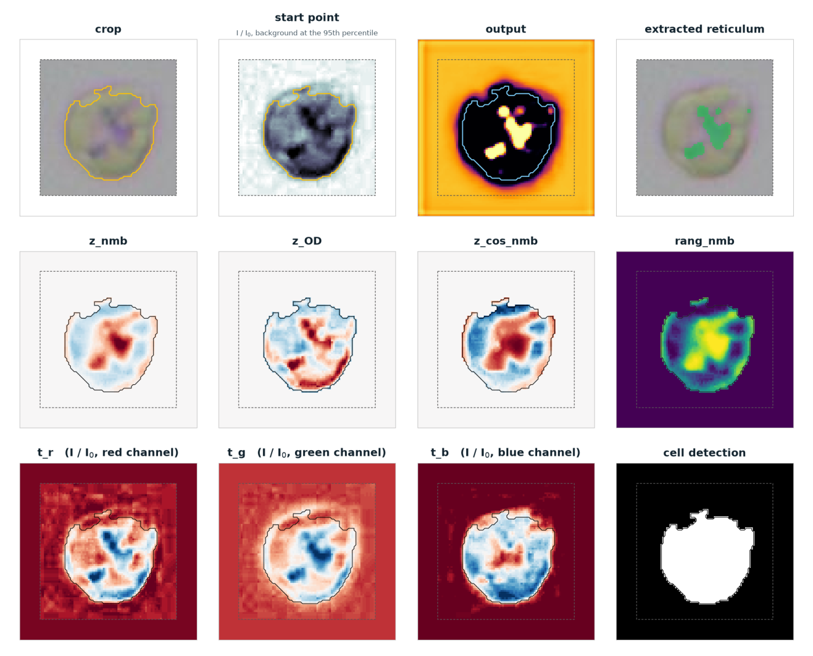

La **normalisation par lame** soustrait la transmittance médiane de 400 hématies
de l'acquisition elle-même, tirées sur une image sur cinq pour couvrir la dérive
de coloration le long du frottis. C'est la seule calibration de la chaîne, et
elle n'utilise aucune annotation.

**Architecture et entraînement.** U-Net (Ronneberger et al., 2015) à deux
niveaux de sous-échantillonnage (16, 32 et 64 filtres), soit 119 313 paramètres.
La perte combine une entropie croisée binaire et un soft-Dice, toutes deux
masquées : poids nul hors de la cellule et sur les pixels marqués « douteux ».
L'optimiseur est Adam (10⁻³), avec au plus 120 époques et un arrêt précoce sur
une validation interne séparée par lame. Les patchs font 64 × 64 et
l'augmentation est géométrique (rotations, zoom, translations, 8 symétries) et
photométrique, appliquée en densité optique (gain, décalage gris, teinte, bruit).
Trois réseaux entraînés avec des graines différentes sont moyennés à
l'inférence.

**Corpus.** 200 imagettes issues de 46 lames, annotées au pixel en trois
étiquettes (fond, réticulum, douteux), partitionnées **par lame** : 162 imagettes
(35 lames) pour l'apprentissage, 38 imagettes (11 lames) pour le test seul.
Une trentaine de configurations ont été comparées en validation croisée à 5
plis par lame. Les écarts sont appariés imagette par imagette, avec des
intervalles de confiance par rééchantillonnage.

### 2.4 Calibration de l'IRF

L'indice $d_i$ a été choisi parmi plusieurs candidats sur les seuls échantillons
d'apprentissage. Il est préféré à une aire seuillée : une somme de probabilités
reste proportionnelle sur une cellule faiblement réticulée, là où un seuil rend
zéro. La porte $\tau = 266{,}24$ a été ajustée **une seule fois** sur
25 échantillons, puis évaluée sur 11 échantillons réservés qui n'ont servi à
aucun autre choix. Deux alternatives ont été écartées : le seuil optimal par
échantillon ne dérive pas avec la richesse en réticulocytes (r = −0,12), et une
porte affine fait moins bien sur la réserve.

### 2.5 Protocole d'évaluation

L'évaluation distingue trois niveaux, car les métriques usuelles de détection
(Average Precision notamment) mesurent la qualité de localisation, qui est sans
effet sur un rapport de comptes :

- **objet** : rappel, précision et F1 par classe, et surtout matrice de
  confusion, seule à distinguer une erreur de détection d'une erreur de
  classification. L'appariement se fait par centre, indépendamment de la classe
  et de façon bijective ;
- **échantillon** : comparaison de méthodes contre le Sysmex XN selon le guide
  CLSI EP09c. La régression de Passing-Bablok (Passing et Bablok, 1983) ne
  suppose aucune des deux méthodes exempte d'erreur ; l'analyse de Bland-Altman
  (Bland et Altman, 1986) sépare biais constant et biais proportionnel. Le
  coefficient de corrélation est écarté, car il mesure une association et non
  une concordance ;
- **pixel** : coefficient de Dice, interprété au regard de l'accord de
  l'annotateur avec lui-même.

Un audit de provenance vérifie au préalable qu'aucun échantillon évalué
n'apparaît dans l'entraînement.

---

## 3. Résultats

### 3.1 Détection et classification

**Diagnostic du modèle de référence.** Sur le jeu de test, le détecteur de départ
retrouve 99,51 % des objets toutes classes confondues. Le recouvrement médian avec
l'annotation vaut 0,942. Sur les 239 réticulocytes manqués, 232 sont détectés
mais étiquetés « hématie », et 7 seulement échappent à la détection. L'erreur se
situe donc dans la lecture de la granulation. Le rappel varie par ailleurs de
0,66 à 0,93 selon le test, avec un écart systématique de 16 points entre
collections d'échantillons. Une évaluation ne s'interprète donc qu'accompagnée de
la composition du jeu qui la produit.

**Leviers.** Moyennes sur la validation, sur le nombre de tirages indiqué :

| Condition | Tirages | F1 réticulocytes | F1 débris | Décision |
|---|---|---|---|---|
| Contrôle | 4 | 74,77 | 86,84 | référence |
| Ancres carrées | 4 | 75,11 | **90,65** | retenue |
| Résolution d'entrée 1 152 px | 4 | 75,67 | 83,43 | écartée (perte sur les débris) |
| Augmentation photométrique | 4 | 74,69 | 86,67 | effet non significatif |

Deux autres effets ont été établis. La longueur d'entraînement compte : un
cosinus tronqué, dont le taux d'apprentissage ne descendait jamais sous 86 % de
son maximum, faisait osciller le F1 de 4,6 points entre deux points d'arrêt
voisins. Le volume de la classe rare pèse aussi davantage que la propreté du jeu :
une version épurée (RET v5), qui perd près de la moitié des réticulocytes, cède
2,20 points de F1.

**Modèle retenu** (jeu de test, seuil 0,20) :

| Classe (objets réels) | Modèle | Rappel % | Précision % | F1 % |
|---|---|---|---|---|
| Hématies (22 811) | référence | 99,03 | 98,89 | 98,96 |
| | retenu | 99,11 | 98,57 | 98,84 |
| Réticulocytes (985) | référence | 75,74 | 82,25 | 78,86 |
| | retenu | **79,49** | **83,92** | **81,65** |
| Débris (374) | référence | 74,87 | 93,65 | 83,21 |
| | retenu | 89,04 | 81,02 | 84,84 |
| Leucocytes (76) | référence | 100,0 | 54,68 | 70,70 |
| | retenu | 94,74 | 97,30 | 96,00 |
| F1 macro | | | | 82,93 → **90,33** |

La confusion qui sous-estime le taux, un réticulocyte lu comme hématie, passe de
232 à 195 cellules. Les objets « inventés » par le modèle se situent aux trois
quarts sur le bord du champ ou sur la jointure des demi-images, pour les
hématies. Pour les débris, 92 % sont en plein champ : ce sont des objets réels
non annotés. La précision mesurée sur ces classes est donc un plancher.

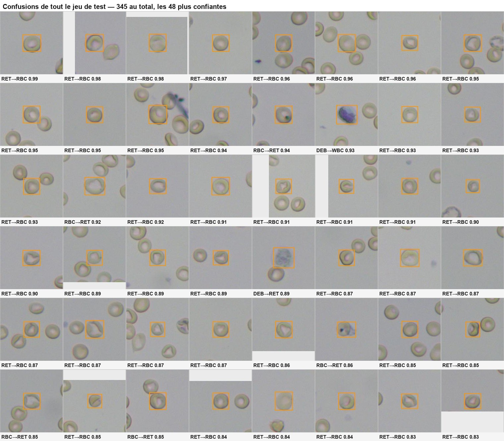
*Les 48 confusions les plus confiantes du jeu de test.*

### 3.2 Accord inter-lecteurs

Un second lecteur a reclassé 500 cellules détectées (250 hématies et
250 réticulocytes) sans accès à l'annotation. Il obtient un rappel de 94,0 %
[90,3 ; 96,3] et une spécificité de 98,4 % [96,0 ; 99,4]. Ramenée à la prévalence
réelle (4,14 %), cette spécificité correspond à une précision de 71,7 %
[51,6 ; 88,1]. Le lecteur humain est plus sensible que le modèle (94,0 % contre
79,49 %), mais moins spécifique : il lit 1,6 % des hématies comme des
réticulocytes, contre 0,61 % pour le modèle. Une exigence de 95 % de rappel et
de précision est donc hors d'atteinte de tout modèle évalué sur cette annotation.

### 3.3 Pourcentage de réticulocytes contre le Sysmex XN

| 53 tests | Pente de Passing-Bablok [IC 95 %] | Biais | Erreur absolue moyenne |
|---|---|---|---|
| Modèle retenu | 1,086 [0,966 ; 1,223] | +0,03 pt | **0,78 pt** |
| Modèle de référence | 1,046 [0,921 ; 1,279] | +0,49 pt | 1,19 pt |
| Annotations manuelles | intervalle contenant 1 | non significatif | 0,56 pt |

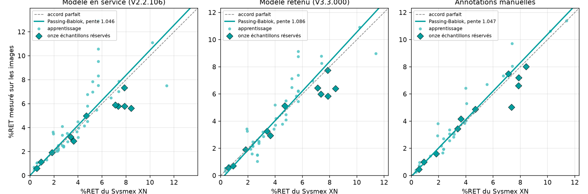

Le gain mesuré à l'échelle de la cellule se retrouve à l'échelle de l'échantillon.
Les limites d'agrément (−2,15 / +2,21 points) sont à peu près constantes en valeur
absolue ; une performance sur ce taux s'exprime donc en points plutôt qu'en valeur
relative. La comparaison des annotations manuelles au XN constitue en outre une
validation externe de la vérité terrain.

Rejouée sur une cohorte élargie de 112 échantillons, la chaîne donne une erreur
absolue de 0,52 point et un biais de −0,26 point. La pente vaut toutefois
0,918 [0,859 ; 0,970] : son intervalle exclut 1, ce qui révèle une légère
sous-estimation aux taux élevés, invisible sur 53 tests.

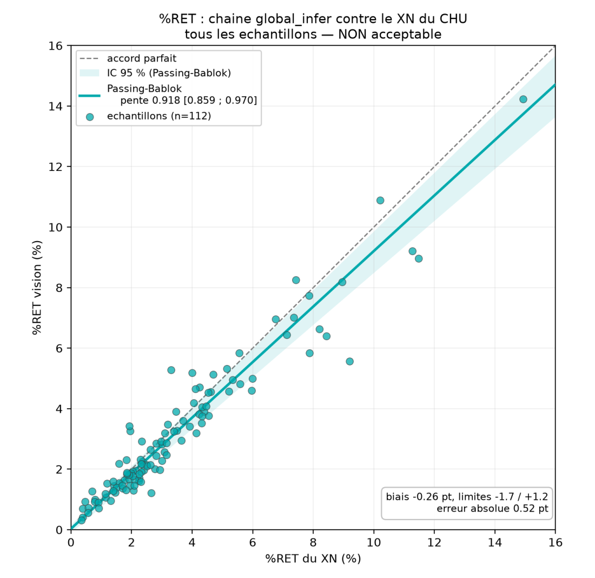

### 3.4 Segmentation du réticulum

Sur les 38 imagettes de test, le Dice vaut **0,618**. Il tombe à 0,415 sur les
cellules portant 100 pixels de réticulum ou moins. Pour situer ce chiffre, 22
imagettes de test ont été réannotées à blanc par le même annotateur, et cette
seconde lecture sert de référence commune :

| Jugés par la 2ᵉ lecture | Dice |
|---|---|
| Annotateur (1ʳᵉ lecture) | 0,622 |
| Réseau | 0,578 |
| Écart apparié | −0,030 [−0,119 ; +0,065] |

Sur ces 22 imagettes, **le réseau ne se distingue pas de l'annotateur**. Une
tolérance d'un pixel fait disparaître environ un tiers du désaccord des deux
côtés. Parmi les choix d'entrée, les quatre canaux relatifs à la cellule
apportent environ 0,03 de Dice. Onze canaux physiques supplémentaires n'apportent
rien de mesurable et triplent le temps de calcul : le réseau les reconstruit à
partir de l'image.

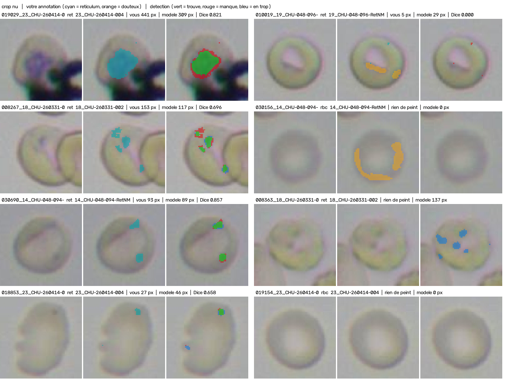
*Imagette, annotation humaine (cyan : réticulum ; orange : douteux), masque du
réseau (vert : trouvé ; rouge : manqué ; bleu : en trop).*

### 3.5 Fraction de réticulocytes immatures

| 11 échantillons réservés | |
|---|---|
| Pente de Passing-Bablok | 0,937 [0,754 ; 1,173] |
| Biais moyen | +0,13 pt [−1,96 ; +2,22] |
| Erreur absolue moyenne | **2,39 pt** |
| Limites d'agrément | −5,97 / +6,23 pt |
| Étendue couverte | IRF de 2,4 à 39 % |

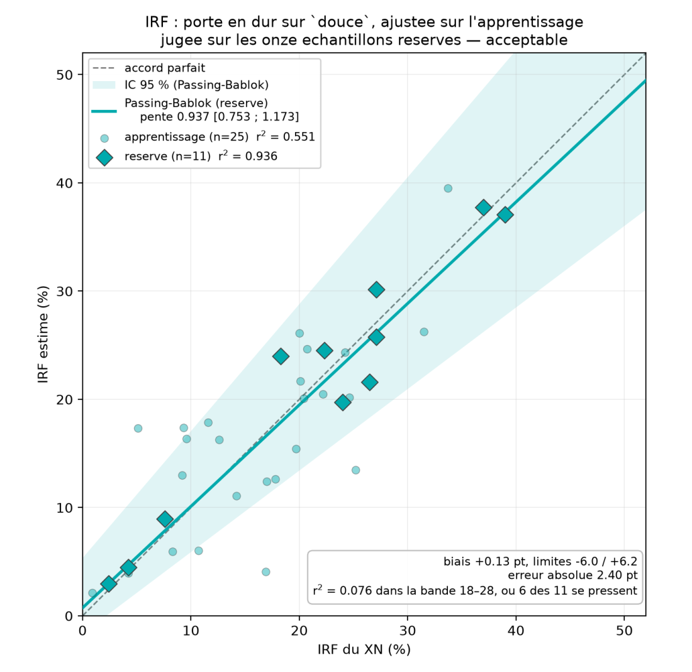

La pente contient 1 et le biais n'est pas significatif. Par tranche, l'erreur
vaut 0,74 point sous 10 % d'IRF, 3,58 points entre 10 et 30 %, et 1,32 point
au-delà. L'essentiel de l'écart se concentre donc dans la bande intermédiaire.

**Cohorte élargie.** Rejouée par lot sur 148 tests, la chaîne donne, sur les
51 échantillons hors apprentissage, une erreur absolue de 2,98 points, un biais
de +0,26 point et une pente de 0,975 [0,842 ; 1,113]. Sur les 40 échantillons
jamais utilisés pendant l'étude, l'erreur absolue vaut 2,72 points, le biais
+0,62 point et la pente 1,028 [0,875 ; 1,210]. Les limites d'agrément restent
larges (−7,8 / +8,4 points hors apprentissage).

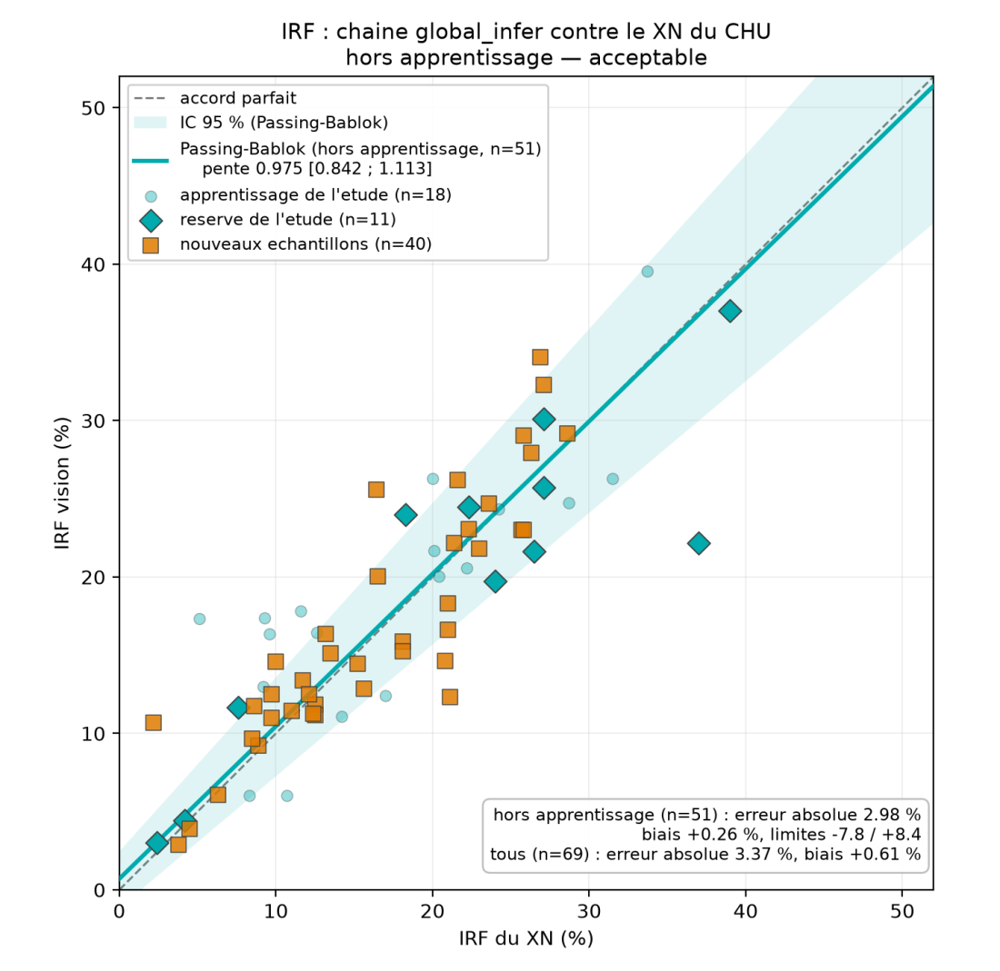

Dans cette cohorte, les 11 échantillons réservés donnent 3,9 points d'erreur au
lieu de 2,39. L'écart provient de tests supplémentaires. Sur les tests de
l'étude, la chaîne retrouve les mêmes valeurs à quelques centièmes près ; en
revanche, un second test de l'échantillon CHU-260414-001 donne 6,5 % contre
37,8 % pour le premier (XN : 37,0 %). Cet écart n'est pas expliqué à ce jour.

### 3.6 Contrôle visuel : le scattergramme

Un seuil ajusté sur des proportions peut se placer au milieu du bruit sans
qu'aucun indicateur d'accord ne le signale : un estimateur qui se trompe dans les
deux sens donne une IRF moyenne correcte. La chaîne reconstruit donc le plan de
l'analyseur de référence. En abscisse figure l'indice $d$, c'est-à-dire la
grandeur même qui porte la porte ; en ordonnée, l'hémoglobine intégrée sur la
cellule, analogue de la diffusion vers l'avant. On retrouve la morphologie
observée sur l'analyseur : une masse dense et une queue d'autant plus longue que
l'IRF est élevé.

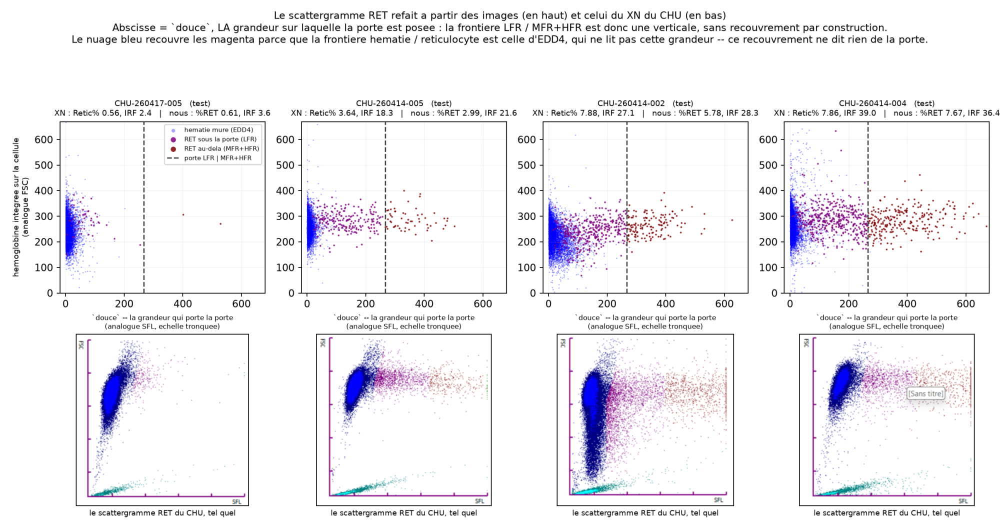

### 3.7 Coût de calcul

| Étape (60 images, 24 328 cellules, RTX 5070) | Temps | Part |
|---|---|---|
| Détection EfficientDet-D4 (ONNX Runtime, CUDA) | 11,0 s | 32 % |
| Normalisation par lame (400 hématies) | 0,8 s | 2 % |
| Segmentation U-Net sur toutes les cellules | 19,9 s | 57 % |
| Écriture des sorties | 0,3 s | 1 % |
| **Total** | **34,9 s** | |

Le coût est de 0,15 s par image en détection et de 0,82 ms par cellule en
segmentation, préparation des entrées comprise. Deux choix y contribuent : les
canaux relatifs à la cellule sont calculés sur le GPU par lots, et le détecteur
est coupé en deux graphes, le tronc convolutif sur le GPU et la suppression des
non-maxima sur le CPU, pour des détections identiques.

---

## 4. Discussion et limites

**Le détecteur classe, le segmenteur gradue.** Utilisée comme classifieur
hématie / réticulocyte, avec un seuil sur $d$ choisi sur l'apprentissage,
l'extraction du réticulum atteint un F1 de 0,73, contre 0,82 pour le détecteur
seul. La séparation des deux classes repose sur le contexte du champ entier, que
seul le détecteur voit. Les deux étages ont donc des rôles distincts, ce qui
justifie d'avoir amélioré la classification dans le détecteur plutôt que de
l'ajouter en aval.

**Reproductibilité d'une configuration et d'un modèle.** Sur trois tirages de la
configuration finale, l'écart-type du F1 réticulocytes vaut 0,085, contre 1,15
pour le rappel et 1,55 pour la précision, qui varient en sens inverse. La
qualité d'une configuration est donc très reproductible, mais son point de
décision ne l'est pas. Une configuration se juge sur son F1 ; un modèle livré,
sur son rappel.

**Domaine de validité.** Les lames colorées avec un réactif antérieur expliquent
les lames aberrantes, par un mécanisme inattendu. La teinte du réticulum
est inchangée, mais celle des hématies mûres bascule de 22,2° à 105,2° par
rapport à la direction de l'hémoglobine. Un angle supérieur à 60° fournit un
critère simple de détection des lames hors domaine.

**Limites.**

- Le rappel et la précision des réticulocytes (79,49 % et 83,92 %) restent
  inférieurs à 95 %, niveau que l'accord inter-lecteurs montre hors d'atteinte
  sur cette annotation.
- L'IRF est jugée sur une réserve de 11 échantillons prélevés sur deux journées
  consécutives, avec une lacune entre 7,6 et 18,3 % d'IRF. Des imagettes
  d'apprentissage du U-Net proviennent en outre de lames de ces échantillons. Les
  limites d'agrément (environ ±6 points) restent larges au regard des seuils
  cliniques.
- Une partie de la vérité terrain de détection a été pré-annotée par le modèle
  évalué ; les chiffres de détection constituent une borne supérieure.
- L'écart de 16 points de rappel entre collections d'échantillons n'est pas
  réduit.
- Une estimation du contenu en hémoglobine des réticulocytes (RET-He), tirée de
  l'hémoglobine intégrée, reste exploratoire (pente de 0,58 contre le XN).
- Ces résultats comparent une méthode à un analyseur de référence. Ils ne
  constituent pas une validation analytique : répétabilité, linéarité et limites
  de détection n'ont pas été étudiées.

**Perspectives**, par rapport coût / bénéfice croissant :

1. constituer un jeu de validation propre, nécessaire au réglage de seuils par
   classe ;
2. étendre la mesure d'accord inter-lecteurs à des cellules tirées dans leurs
   proportions réelles ;
3. élargir la cohorte de comparaison à davantage de journées de prélèvement ;
4. reprendre la résolution d'entrée de 1 152 pixels, que les ancres carrées ont
   rendue abordable en mémoire, en traitant explicitement la classe débris.

Côté calcul, restreindre la segmentation aux seuls réticulocytes ramènerait la
chaîne à environ 15 s par test.

---

## 5. Reproduction

Les modèles entraînés et les images ne sont pas distribués. Le format attendu des
modèles et leurs empreintes SHA-256 sont décrits dans
[`models/README.md`](models/README.md).

### Installation

Testé avec Python 3.12, PyTorch 2.11 (CUDA 12.8), ONNX Runtime GPU 1.25 et une
RTX 5070 (12 Go).

```bash
pip install -r requirements.txt
```

Placer `EDD4d_RET-V3.3.000.onnx` (détecteur) et `modele_rapide_t8.pt` (U-Net)
dans `models/`. On peut aussi indiquer leurs chemins avec `--modele-detection` et
`--modele-maturite`, ou avec les variables d'environnement `RET_MODELE_DETECTION`
et `RET_MODELE_MATURITE`.

### Exécution

Une acquisition :

```bash
python -m ret_inference chemin/vers/acquisition/pictures --sortie sorties/test --coupe
```

Un dossier d'acquisitions, avec reprise après interruption et tableau
récapitulatif :

```bash
python scripts/traiter_lot.py dossier_des_acquisitions --sortie sorties/ --coupe
```

Depuis Python :

```python
from ret_inference.chaine import traite

res = traite("acquisition/pictures", sortie="sorties/acquisition", coupe=True)
print(res["resultats"]["pct_ret"], res["resultats"]["irf"])
```

| Option | Effet |
|---|---|
| `--coupe` | détecteur coupé en deux graphes (tronc GPU, NMS CPU) : environ 1,5 fois plus rapide, détections identiques ; demande `onnx` |
| `--sur-cpu` | même chaîne sans GPU (résultats identiques en %RET et IRF sur un sous-ensemble de contrôle, plusieurs minutes par test) |
| `--motif` | motif des images à lire (défaut `Picture*.jpg`) |
| `--sans-figure` | ne trace pas le scattergramme |

### Sorties

```
sorties/<acquisition>/
├── ret_inference_EDD4d_RET-V3.3.000_No_60/
│   └── Preclassifier_output.xml   annotations par cellule + bloc <Analysis> (%RET, IRF, porte)
├── scattergramme_RET.png          plan (indice d, hémoglobine intégrée)
├── cellules.npz                   une ligne par globule rouge : boîte, classe, score, d, hémoglobine…
└── resume.json                    résultats et chronométrage de chaque étape
```

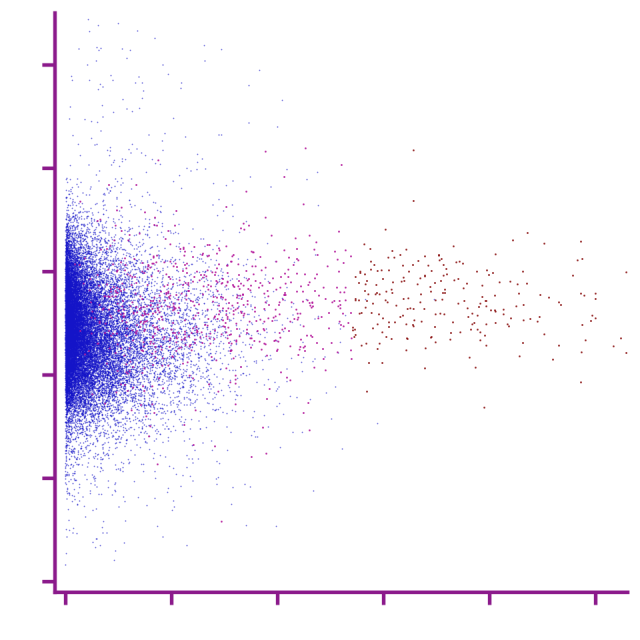

Le fichier XML reprend le format d'annotation utilisé pour la vérité terrain, ce
qui permet de relire et de corriger les prédictions dans l'outil d'annotation.
Chaque cellule mesurée porte son indice $d$ et sa décision de maturité.

**Vérification.** Sur une acquisition de référence (60 images, 24 328 globules
rouges retenus), les sorties de ce dépôt sont identiques au bit près à celles de
la chaîne d'étude : mêmes cellules, mêmes grandeurs, même XML et même image
(même empreinte SHA-256). On obtient 917 réticulocytes, un %RET de 3,769 % et
une IRF de 26,28 % (241 / 917).

<br clear="right">

---

## 6. Organisation du dépôt

```
Reticulocyte/
├── ret_inference/          paquet d'inférence (python -m ret_inference)
│   ├── chaine.py           orchestration et ligne de commande
│   ├── config.py           chemins des modèles, porte τ, motif des images
│   ├── edd4.py             inférence ONNX du détecteur et post-traitement
│   ├── coupe_gpu.py        détecteur coupé : tronc GPU, NMS CPU
│   ├── detection.py        détection sur l'acquisition, sélection des globules rouges
│   ├── noyau.py            densité optique, déconvolution, masque de cellule, normalisation par lame
│   ├── reseau.py           U-Net
│   ├── rapide.py           préparation des entrées et inférence par lots sur GPU
│   ├── maturite.py         normalisation par lame, puis indice d sur chaque cellule
│   ├── recognition.py      %RET, IRF et fichier XML
│   └── figures.py          scattergramme
├── scripts/traiter_lot.py  traitement d'un dossier d'acquisitions
├── models/README.md        contrat des modèles (non distribués)
├── docs/images/            figures
└── requirements.txt
```

Ne figurent pas dans ce dépôt : les modèles, les images, le code d'entraînement,
le corpus annoté au pixel et les scripts de comparaison à l'analyseur de
référence.

---

## Références

- Bland, J. M., & Altman, D. G. (1986). Statistical methods for assessing agreement between two methods of clinical measurement. *The Lancet*, 1(8476), 307–310.
- CLSI (2004). *H44-A2 : Methods for reticulocyte counting.* Clinical and Laboratory Standards Institute.
- CLSI (2018). *EP09c : Measurement procedure comparison and bias estimation using patient samples.* Clinical and Laboratory Standards Institute.
- Lin, T.-Y., Goyal, P., Girshick, R., He, K., & Dollár, P. (2017). Focal loss for dense object detection. *ICCV*.
- Passing, H., & Bablok, W. (1983). A new biometrical procedure for testing the equality of measurements from two different analytical methods. *Journal of Clinical Chemistry and Clinical Biochemistry*, 21(11), 709–720.
- Quadrianto, N., Smola, A. J., Caetano, T. S., & Le, Q. V. (2009). Estimating labels from label proportions. *JMLR*, 10, 2349–2374.
- Ronneberger, O., Fischer, P., & Brox, T. (2015). U-Net: Convolutional networks for biomedical image segmentation. *MICCAI*.
- Ruifrok, A. C., & Johnston, D. A. (2001). Quantification of histochemical staining by color deconvolution. *Analytical and Quantitative Cytology and Histology*, 23(4), 291–299.
- Tan, M., Pang, R., & Le, Q. V. (2020). EfficientDet: Scalable and efficient object detection. *CVPR*.

---

*François Martinez, École Centrale Méditerranée, 2026. Travail réalisé dans le
cadre d'un stage de fin d'études.*
